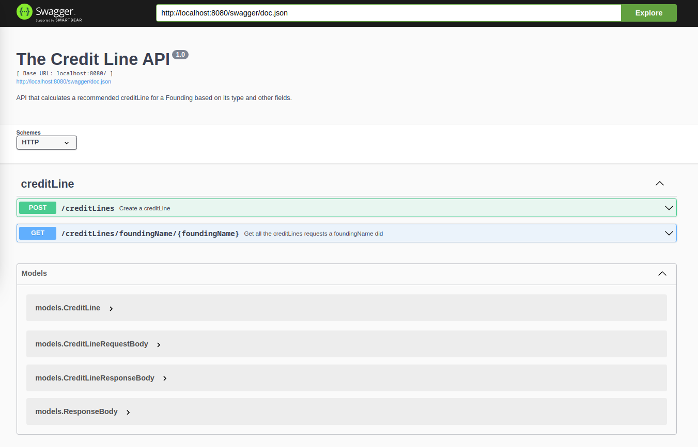
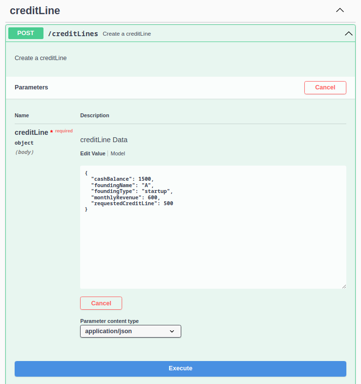
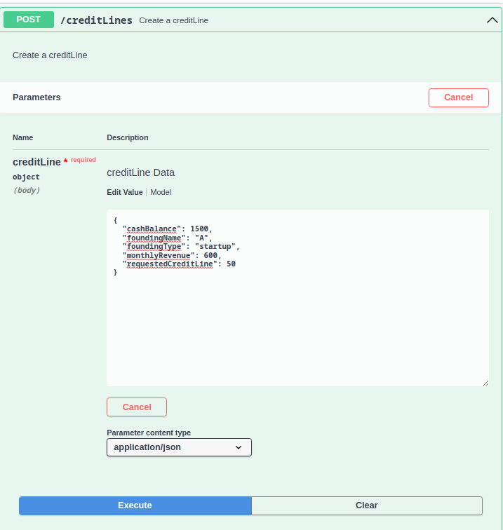
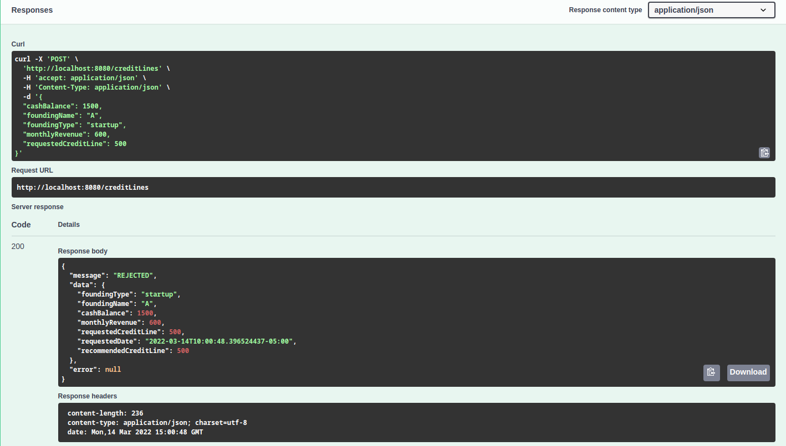
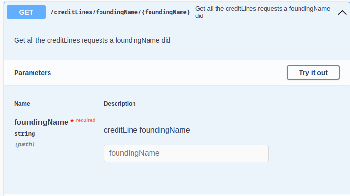
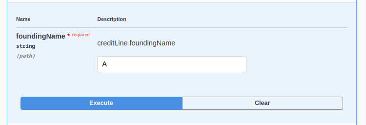

# The Credit Line API
## V.1

Hopping you are having a great day I present you  my code. In order to be able to run this API you'll have to do some steps.

- To begin with, it is important to execute my go.mod file, so all the dependencies will be installed.
  Just open the console in the project path and type ```  go mod tidy ```
- Now we need to set up our database configuration. An in memory database (SQLite3) is configured, you just have to go to the  ``` /database/db.go``` file, uncomment that code section that starts with "SQLITE3" and comment the "MYSQL" section.
  However, if you want to set a local one I set a mysql connection, you can configure your local variables in the  ``` /database/db.go``` file, just change the values and put your local ones.

- Finally, you have to execute the following command in you terminal ```  go run main.go ```

- Now the API is running on your localhost 8080 port

## Documentation
This application was documented using Swagger, you can access this going to the following link : http://localhost:8080/swagger/index.html#/ so you can try the created endpoints.

- You'll see this interface



- You have to click the post section and then click on execute



- You can edit the requestBody values, change them, and now press execute 

 

- You'll see the response body in the below part


- Even though it was not part of the requirements, I implemented a get end point, so I can check the requests made by a Founding


- To use this, click on "Try it out", write the foundingName and then execute


Nevertheless, you can always test the endpoint using postman or your favourite application.

